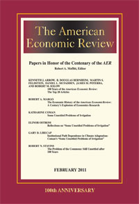

# AER-Skills

<p align="center">
  
</p>
<p align="center"><em>面向 <a href="https://www.aeaweb.org/journals/aer">《美国经济评论》</a>（AER）、<em>AER: Insights</em> 及 AEJ 系列期刊的 agent skill 栈。</em></p>

[](LICENSE)
[](docs/workflow-map.md)
[](docs/design-principles.md)
[](docs/installation-claude.md)
[](docs/installation-codex.md)

简体中文 | [English](README.en.md)

面向 *American Economic Review*（AER）、*AER: Insights* 以及 *AEJ* 系列期刊的 **agent skill 包**：覆盖**选题、写作、识别策略、表图规范、投稿、审稿回复**的全流程。

本仓库是有立场的。它**不是**通用经济学写作工具箱，而是一套**面向 top-5 经济学**的 skill 栈：识别优先的实证、AEA 政策合规的复现包、Keith Head 风格的引言、AER 风格的 booktabs 表格、以及对编辑友好的 rebuttal 文体。

---

## 为什么需要单独的 AER skill 栈？

Top-5 经济学期刊的硬约束在生命科学类期刊中并不存在：

| 约束维度                | AER                | AER: Insights       | 含义                                              |
|-----------------------|--------------------|---------------------|-------------------------------------------------|
| 摘要字数                | **100 词**         | 100 词              | 4-5 句话。卖结果，不卖动机。                          |
| 正文长度                | ~40 排印页         | **≤ 7,000 词减每个 exhibit 200 词** | 行文要紧；5 个 exhibits 时上限为 6,000 词。          |
| Desk rejection        | 高                 | **~45%**            | 前三页决定生死。                                    |
| 复现要求                | 强制               | 强制                | AEA 数据与代码可用性政策有专人审核执行。               |
| 识别策略                | 因果、设计驱动      | 因果、设计驱动        | TWFE、弱 IV、朴素 RDD 会被直接 desk-reject。         |
| Cover letter          | 可选               | 可选                | 仅用于 COI 披露或数据访问限制说明。                   |
| Disclosure statements | 必需               | 必需                | 每位合作者单独提交一份 PDF；即使没有冲突也要明说。       |

通用的 "scientific writing" skill（例如 [Nature-Paper-Skills](https://github.com/Boom5426/Nature-Paper-Skills)、[nature-skills](https://github.com/Yuan1z0825/nature-skills)）通常覆盖不到这些约束。

---

## 快速上手

### 方式 A — Claude Code 插件（推荐）

```bash
# 添加 marketplace（一次性）
/plugin marketplace add https://github.com/brycewang-stanford/AER-Skills

# 安装插件
/plugin install aer-skills

# 重新加载
/reload-plugins
```

之后十个 skill 会全部自动可用。

### 方式 B — 脚本安装

```bash
git clone https://github.com/brycewang-stanford/AER-Skills.git
cd AER-Skills

# Claude Code（用户级）
python3 scripts/install_skills.py claude

# 或 Codex
python3 scripts/install_skills.py codex
```

安装脚本会复制完整 skill 目录。更新已有安装时加 `--replace`，正式复制前可用
`--dry-run` 预览计划中的复制操作。如果想用 skill 引用到的 `templates/` 和
`examples/` 资源，请保留这个 cloned repository。

### 第一个提示词

重启 agent 后：

```text
用 aer-workflow 告诉我这篇稿子下一步该用哪个 skill。
```

更完整的安装说明见 [docs/installation-claude.md](docs/installation-claude.md)
和 [docs/installation-codex.md](docs/installation-codex.md)。

---

## 默认工作流

```text
aer-topic-selection
    -> aer-identification
        -> aer-robustness
            -> aer-introduction
                -> aer-tables-figures
                    -> aer-replication
                        -> aer-submission
                            -> aer-rebuttal
```

核心默认假设：

- **识别先于写作** — 设计有问题，写得再漂亮也救不回来
- **AER vs AER:Insights vs AEJ** 是个**选刊路由**问题，要在写摘要之前先决定
- **复现包质量是论文的一部分**，不是事后补的工作
- **审稿回复信永远针对修改后的稿件**，绝不对着旧稿写

完整路线图见 [docs/workflow-map.md](docs/workflow-map.md)。

---

## 全部 Skill

### 核心 — 全生命周期

| Skill | 用途 |
|---|---|
| [`aer-workflow`](skills/aer-workflow/SKILL.md) | 路由总表。下一步该用哪个 skill 由它决定。 |
| [`aer-topic-selection`](skills/aer-topic-selection/SKILL.md) | Top-5 标准检测、新颖性审计、AER/Insights/AEJ 路由。 |
| [`aer-identification`](skills/aer-identification/SKILL.md) | DiD（错时）、IV（弱 IV 稳健）、RDD、SCM、shift-share/Bartik。 |
| [`aer-robustness`](skills/aer-robustness/SKILL.md) | 稳健性、异质性、机制、安慰剂 — 提前回应审稿人。 |
| [`aer-introduction`](skills/aer-introduction/SKILL.md) | Keith Head 五段式引言公式 + 100 词摘要起草。 |
| [`aer-tables-figures`](skills/aer-tables-figures/SKILL.md) | AER booktabs 风格、`etable`/`estout`/`modelsummary`、figure notes。 |
| [`aer-replication`](skills/aer-replication/SKILL.md) | AEA 数据与代码可用性政策、README、openICPSR。 |
| [`aer-submission`](skills/aer-submission/SKILL.md) | 格式预审、cover letter、长度审计、利益冲突声明。 |
| [`aer-rebuttal`](skills/aer-rebuttal/SKILL.md) | R&R 回复信、分类、让步 / 澄清 / 反驳的决策规则。 |

### 可选 — 实现引擎

在下方手写模板之外，再多给你一个**跑实证**的选择。

| Skill | 用途 |
|---|---|
| [`aer-statspai`](skills/aer-statspai/SKILL.md) | 用 [StatsPAI](https://github.com/brycewang-stanford/StatsPAI) 跑分析 — agent 原生的统一 Python 引擎 + MCP server，覆盖 DiD / IV / RDD / SCM / DML、`audit_result` 稳健性、honest-DiD / Oster 敏感性，以及 `to_latex` / `to_docx` 表格导出。它负责**执行**设计；选哪种设计仍由 `aer-identification` 决定。 |

---

## 代码模板

为三套常见的实证经济学技术栈提供即插即用、版本意识清晰的脚本。每套模板都包含一个
master 脚本、一个 Callaway-Sant'Anna DiD 示例、一张 AER 风格的 booktabs 回归表，
以及一个 README。

| 语言 | 技术栈 | 路径 |
|---|---|---|
| Stata | `reghdfe`、`csdid`、`estout`、`bacondecomp`、`honestdid` | [`templates/stata/`](templates/stata/) |
| R | `fixest`、`did`、`HonestDiD`、`modelsummary`、`fwildclusterboot` | [`templates/r/`](templates/r/) |
| Python | `pyfixest`、`differences`、`linearmodels`、`statsmodels`、`rdrobust`、`rddensity` | [`templates/python/`](templates/python/) |

每套模板都强制：固定随机种子（`20260101`）、相对路径、包版本记录（或在技术栈支持时
精确 pin）、AER booktabs 表格风格、矢量格式图件。

无需手工复制文件即可生成新项目：

```bash
python3 scripts/scaffold_project.py stata /path/to/new-project
python3 scripts/scaffold_project.py r /path/to/new-project
python3 scripts/scaffold_project.py python /path/to/new-project
python3 scripts/scaffold_project.py skeleton /path/to/new-replication-package

# 或使用 Make
make scaffold-stata DEST=/path/to/new-project
```

可用 `--dry-run` 预览计划中的复制操作。脚手架会拒绝仓库内部路径、模板源目录等受保护
目标；请在本仓库之外创建论文项目。

## 校验

在把 skill 复制进 agent 配置或提交 PR 之前，先运行仓库检查：

```bash
make preflight
# 等价命令：python3 scripts/validate_repo.py
```

`make preflight` 还会对 staged 和 unstaged 的 `git diff --check` 做检查，
排查空白和补丁卫生问题。
校验器会检查 skill frontmatter、skill 目录结构、agent metadata、plugin manifest、
本地 Markdown 链接、模板布局、Python 依赖的精确 pin 与 import 覆盖、安装与脚手架脚本
行为、生成/缓存文件的排除，以及 Python/R/Stata 模板语法。当 `Rscript` 不可用时，R 语法
检查会带告警跳过。CI 会安装 R，先运行 `make preflight`，再运行 `make validate-strict` —
后者在缺少可选工具时直接失败，而不是静默跳过。

---

## 示例

以经典 AER 及相邻 top-5 论文为依托的实操示例。
完整索引见 [examples/README.md](examples/README.md)。

| 文件 | 展示什么 |
|---|---|
| [`examples/aer-exemplars.md`](examples/aer-exemplars.md) | 经典论文（Card-Krueger、AJR、ADH、Dell、Chetty-Hendren、Abadie、BDGK、Karlan-List …）逐一映射到各 skill，附 openICPSR / Dataverse 链接 |
| [`examples/modern-aer-exemplars.md`](examples/modern-aer-exemplars.md) | **30+ 篇近期（2018-2025）论文，按 13 个子领域组织** — Labor、Public、Development、Trade、Macro、IO、Health、Environment、Urban、Education、Finance、Political Economy、Social Networks — 外加现代识别方法工具箱，每篇都带 deposit 链接 |
| [`examples/intro-example.md`](examples/intro-example.md) | 完整的 Keith Head 五段式引言 + 97 词摘要，并附一个"不该这么写"的反例 |
| [`examples/rebuttal-example.md`](examples/rebuttal-example.md) | 完整 R&R 回复：cover letter + 编辑 + 3 位审稿人，演示让步 / 澄清 / 反驳 / 拒绝四种处理 |
| [`examples/replication-package-skeleton/`](examples/replication-package-skeleton/) | 可直接 deposit 的目录骨架，含 AEA 合规 README 模板、master 脚本和 globals 文件 — openICPSR 投稿的即用起点 |
| [`examples/staggered-did-demo/`](examples/staggered-did-demo/) | 可运行的 Python/R 模拟：错时处理下 naive TWFE 为什么会失败 |
| [`examples/iv-weak-instrument-demo/`](examples/iv-weak-instrument-demo/) | 可运行的 Python 模拟：弱工具变量下传统 2SLS 推断与 Anderson-Rubin 推断对比 |
| [`examples/rdd-polynomial-demo/`](examples/rdd-polynomial-demo/) | 可运行的 Python 模拟：高阶 global-polynomial RDD 为什么不安全 |

---

## 设计哲学

- **识别驱动，不是叙事驱动。** 写文章之前先把研究设计决定下来并压力测试通过。
- **一篇论文只讲一个贡献。** AER 编辑会枪毙"合格但常规的扩展"；围绕一个最锋利的主张重写。
- **跨领域可读性是硬筛选。** 一篇 labor 文章必须能让 public、macro、IO 经济学家也读懂，否则 desk-reject。
- **用现代计量，不要用 1990 年代的默认值。** TWFE → Callaway-Sant'Anna；first-stage F → Anderson-Rubin；朴素 RDD → 协变量调整的 local linear。
- **复现包是论文的一部分。** README 跑不通就是 AEA Data Editor 卡你的理由。
- **编辑的时间是最稀缺资源。** Cover letter ≤ 200 词。回复信先引用 comment、再说 action、再标出修改后的位置。

完整论述见 [docs/design-principles.md](docs/design-principles.md)。

关键参考文档：

- [Desk-rejection audit](docs/desk-rejection-audit.md) — 从编辑/审稿人视角做的
  投稿前 no-go 检查
- [Methods reference](docs/methods-reference.md) — 估计量默认值、诊断、包调用，
  以及 BibTeX key
- [PNAS Nexus publication plan](docs/pnas-nexus-publication-plan.md) —
  审稿人式审计与一周合规改进计划
- [PNAS Nexus submission checklist](docs/pnas-nexus-submission-checklist.md) —
  稿件、数据、代码和图件的证据驱动终审清单
- [Source register](docs/source-register.md) — AEA 官方政策来源，以及 repo 中依赖
  这些政策的表面
- [Glossary](docs/glossary.md) — 期刊、识别、复现、回复信术语的共享词表

---

## 仓库结构

```text
AER-Skills/
├── README.md               (中文，主入口)
├── README.en.md            (英文，完整版)
├── LICENSE                 (MIT)
├── Makefile                (校验与安装快捷命令)
├── CONTRIBUTING.md         (并发 agent 工作流)
├── .github/
│   └── workflows/ci.yml    (仓库校验)
├── .claude-plugin/
│   ├── plugin.json         (插件清单)
│   └── marketplace.json    (Claude Code marketplace 条目)
├── docs/
│   ├── desk-rejection-audit.md
│   ├── design-principles.md
│   ├── glossary.md
│   ├── installation-claude.md
│   ├── installation-codex.md
│   ├── methods-reference.md
│   ├── pnas-nexus-publication-plan.md
│   ├── pnas-nexus-submission-checklist.md
│   ├── source-register.md
│   └── workflow-map.md
├── skills/                 (10 个 skill 目录 — SKILL.md + agents/openai.yaml)
│   ├── aer-workflow/
│   ├── aer-topic-selection/
│   ├── aer-introduction/
│   ├── aer-identification/
│   ├── aer-robustness/
│   ├── aer-tables-figures/
│   ├── aer-replication/
│   ├── aer-submission/
│   ├── aer-rebuttal/
│   └── aer-statspai/       (可选实现引擎)
├── templates/              (即插即用流水线，三种语言都有)
│   ├── stata/
│   ├── r/
│   └── python/
├── scripts/
│   ├── install_skills.py
│   ├── scaffold_project.py
│   └── validate_repo.py
└── examples/
    ├── aer-exemplars.md
    ├── intro-example.md
    ├── rebuttal-example.md
    └── replication-package-skeleton/
        ├── data/codebook/source-register.md
        └── docs/exhibit-register.md
```

---

## 适用 / 不适用

**适用：**

- *American Economic Review*（长文，≤ 40 页）
- *American Economic Review: Insights*（短文，≤ 7,000 词减每个 exhibit 200 词；5 个 exhibits 时 ≤ 6,000 词）
- *American Economic Journal* 系列（Applied / Policy / Macro / Micro）
- 实证或理论经济学稿件
- 田野实验（含 AEA RCT Registry 流程）

**不适用：**

- 金融三大刊工具箱（JF / JFE / RFS 有自己的规范）
- 纯理论栈（没有证明撰写助手）
- 通用 "academic writing" 库

---

## 致谢

Skill 架构参考自 [Boom5426/Nature-Paper-Skills](https://github.com/Boom5426/Nature-Paper-Skills) 与 [Yuan1z0825/nature-skills](https://github.com/Yuan1z0825/nature-skills)。方法论提炼自 **Keith Head**、**Marc F. Bellemare**、**Susan Athey**、**Berk-Harvey-Hirshleifer**、**AEA Data Editor's Office** 以及 *Annual Review of Economics* 的公开资料。

---

## 协议

[MIT](LICENSE)。
